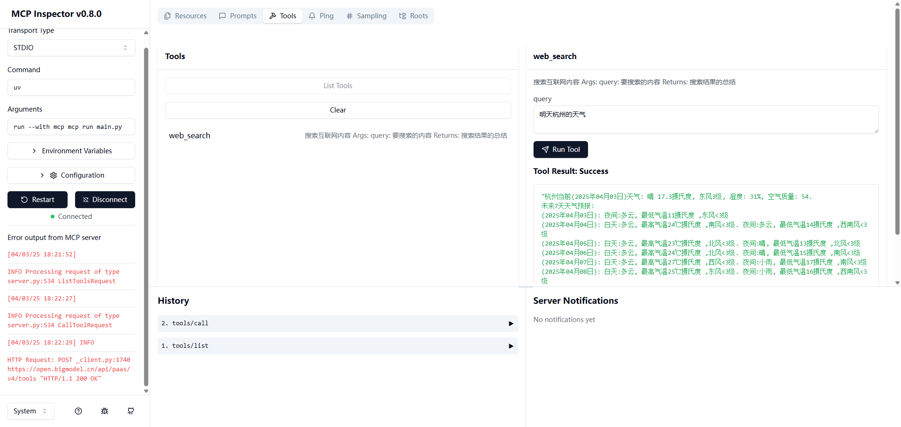

# mcp-server-demo

> 我正在 [BigModel.cn](https://www.bigmodel.cn/invite?icode=JXz37qMbkNdv%2BcyLuGN5tQZ3c5owLmCCcMQXWcJRS8E%3D) 上用智谱 API 打造新一代应用服务，期待和你一起在 [BigModel](https://www.bigmodel.cn/invite?icode=JXz37qMbkNdv%2BcyLuGN5tQZ3c5owLmCCcMQXWcJRS8E%3D) 上探索 AGI 时代的应用。

## 运行

```bash
cd mcp-server-demo
uv sync
mcp dev main.py
```



## 参考资料

- [Model Context Protocol(MCP) 编程极速入门](https://github.com/liaokongVFX/MCP-Chinese-Getting-Started-Guide)
- [智谱 AI 开放平台](https://www.bigmodel.cn/invite?icode=JXz37qMbkNdv%2BcyLuGN5tQZ3c5owLmCCcMQXWcJRS8E%3D)
